## About data visualization

Data are factual information, such as measurements or statistics, used as a basis for reasoning, discussions, or calculations. As a general concept, it refers to the fact that some existing information or knowledge is represented or coded in some form suitable for better usage or processing.

The ultimate goal is to understand the phenomenon described by data, and the ultimate purpose is to generate valuable knowledge.

We do that by using visualizations. However, before going directly from data to visualization, we have to introduce an extra step: data transformation. So, broadly speaking, data processing involves data collection, transformation, and visualization or visual encoding.

Data transformation might involve several steps and might be done for different reasons that we will talk about in more detail in the next project.

The dataset you will be working on this week contains information about movies. You will find it here: [movies.csv](https://drive.google.com/file/d/1SqcQmwsuKuAkWzgDXosGgF2rSbp-0s9W/view?usp=sharing)

Today's task is to freely explore the dataset using Google Sheets.  
From tomorrow, you will start to use a more sophisticated tool called Tableau. Tableau is a Business Intelligence tool for visualization, very widely used in the industry.

Create a new Google Spreadsheet and import the file. During the importing process, the prompt will ask which separator type you should use; select "Comma".

Every dataset describes a particular phenomenon and comes from a specific domain. We need a way to abstract away from the domain. Common structures help us define what visual representations are available and appropriate without familiarity with that business.

For example, let's imagine you have data that describes friendship on Facebook or any social network. One of the appropriate visualizations for this data structure could be a network graph to see the connections between you and all the people you might know among your connected friends. Similarly, if you are trying to analyze biological data describing the interactions between molecules and proteins. In that case, you could also use a network graph. You can see now that all these cases from very different domains with different purposes and goals can be described with the same type of graph. This operation is called Data Abstraction.

So, instead of asking yourself, "How can I visualize this data?" it is always better to ask, "What type of data do I have?" first.

## Data Abstraction

Data Abstraction is the idea that you can describe data in ways that help you decide what encoding methods are available and appropriate for this information.

A dataset can be divided into two big categories: **_Tables and Networks/Trees._**

Tables are the most common type of data. They are composed of a grid of columns and rows. Every row in the table represents one item (one object of the dataset), and every column represents one attribute of these objects. Typically, every single object, unless some data is missing, has information about all the attributes. And every object has to have, at least hypothetically, all the features listed in the table. Therefore, all the items in individual rows have the same number of attributes, and all the elements in that column will be the same type.

In networks and trees, the defining characteristic of this collection of items is that they are connected together by links. In this dataset type, we have a group of items that we call nodes, which are connected by links, so we have nodes and links.

For now, we will focus on tabular data.

## Attribute types

In tabular data, attributes are the columns. Therefore, the first step of data abstraction is identifying the type of attribute we have in our dataset. This will be very important in deciding which plot to use later.

We have three main types of attributes: categorical, ordinal, and quantitative.

### Categorical attributes

A categorical attribute contains values that describe categories. And these categories don't have any particular order.

For example, the below image is a table that shows four columns, "Order ID," "Category," "Priority," and "Sales." The "Category" column has values such as furniture, technology, etc. This is a column that contains categorical attributes and has no inherent order among them.

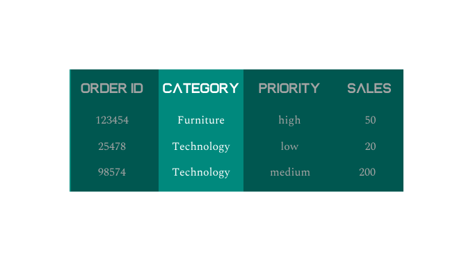

### Ordinal attributes

An ordinal attribute is very similar to a categorical attribute however, the main difference here is that these categories can be ordered. Ordering them is meaningful. For instance, in the example, "Priority" could be low, medium, or high. Another hypothetical example could be a table with a column "Level of Education," which can include values like elementary, high school, undergraduate, and graduate. One thing to notice here is that even though these values can be ordered, there are no distances between these values. Therefore, performing any arithmetic operation between these categories is not meaningful.

So, an ordinal attribute is a collection of categories that can be ordered, and the order has meaning.

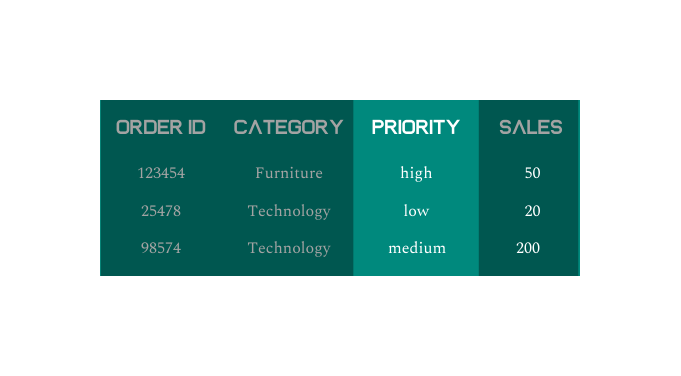

### Quantitative attributes

A quantitative attribute contains values that represent some measured quantity. For instance, the "Sales" columns contain an order's price. These are all numbers that describe a measurement of something. The distance between the values is meaningful and can be computed. In general, with quantitative attributes, you can perform any arithmetic operation among them.

For instance, in a table like this one:

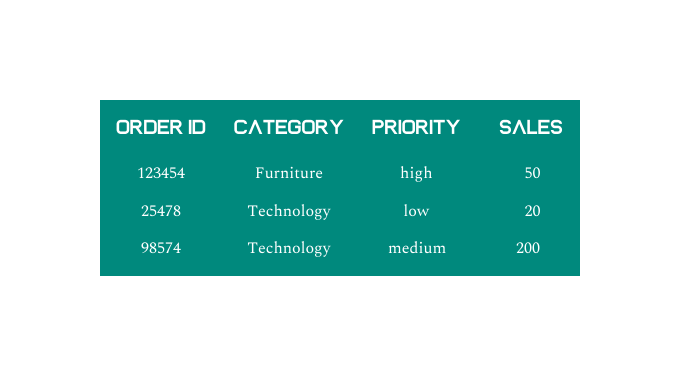

- The "Category" column is a perfect example of a categorical attribute. There are several categories, and there is no inherent order among them.
- The "Priority" column contains values "low," "medium," "high," and "critical." These are also categories that can be ordered. And for this reason, this column is an excellent example of an ordinal attribute.
- The "Sales" column captures the price amount for the order in a particular row and measures a precise quantity. This column is a typical example of a quantitative attribute.

## Attribute semantics

The next step in data abstraction is identifying what we call Attribute Semantics. It is the meaning of some attributes, and there are several predefined semantics that is especially useful to remember.

### Spatial and Temporal

The first one is **_Spatial and Temporal_** Semantics. If a column describes a geographical characteristic, then it's considered **_Spatial_**. If it represents something related to time, then it's considered **_Temporal_**.

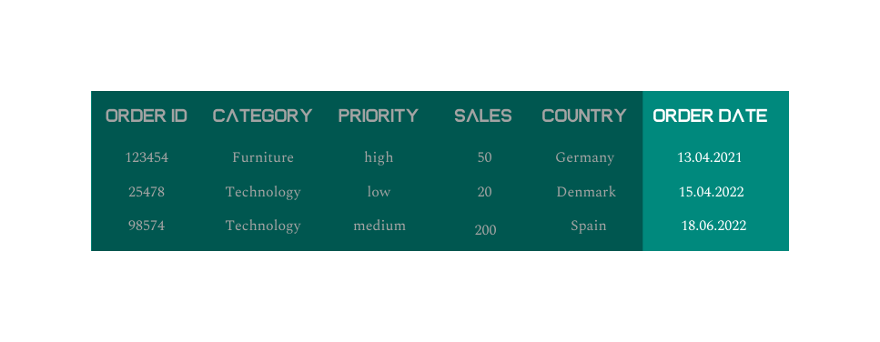

If we take a look at the same dataset from before, we notice there are a couple more columns. The "Country" attribute is clearly categorical, but other than that, it's also spatial because it describes a spatial location.

Another example would be latitude and longitude, which are quantitative attributes but also spatial.

"Order Date" is a quantitative attribute but also temporal.

### Diverging, Cyclic and Hierarchical

Another important aspect is identifying if our attributes are **_sequential_**, **_diverging_**, or **_cyclic_**.

- Sequential have a uniform range from a minimum to a maximum value. For example, the "Sales" column has a range of minimum and maximum price values.
- Diverging is when we can identify a median value and other values that go up or down that value. For example, the "Profit" column in the table above diverges from 0 to positive or negative values.
- Cyclic is where values return to their initial values rather than continuously increasing. Like the day's hour, the day of the week, and the month of the year.
- Hierarchical is where the values have parent and child values. An example of this type of data would be countries and cities under each country.

In reality, there are many more data attribute types and semantics. But, for now, we will stick to these, and you can explore new ones as the course progresses.

### Other things to pay attention to

Let's think about the "Order ID" column. Even though it is a number, this attribute does not represent a quantity. When we do not know the dataset well, the safest thing is to consider the column as a categorical type. If we knew the dataset and where it comes from, we could say that these numbers are sequential and represent the sequence of orders. Therefore the "Order ID" would be an ordinal attribute.

The "Container" column refers to the product container size. The values within this product container's attribute are "small box," "medium box," and "large box." What kind of attribute is this? Here we have another example where the interpretation depends on how much we know about the data. So, for sure, this can be considered a categorical attribute.
The doubt that you may have is whether this is also ordinal. Can the values of these categories be ordered meaningfully? Since the product containers have different volumes, it might be helpful to rank them based on that. Thus, the column contains values with ordinal attributes.

**Now, your turn. Go to the movie dataset from earlier and try to identify the data attribute types and semantics for each column.**

## From data abstraction to data visualization

Knowing what attributes we have in a dataset will guide you in selecting appropriate graphical visual representations.

**Using Google Sheets, try to make a bar chart showing the occurrences of each Genre.**

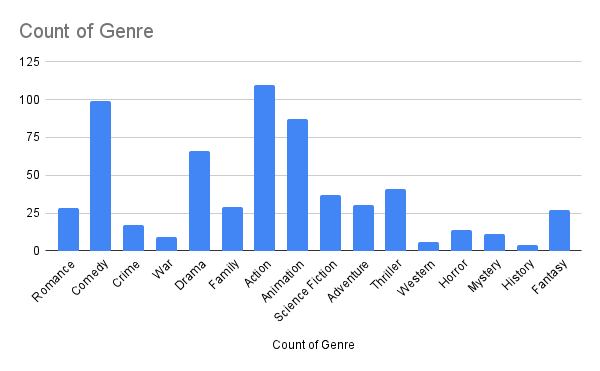

**Now try to do the same using a line chart.**

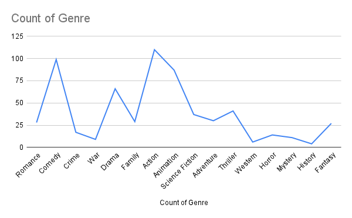

When you look at the line chart, you might think this chart is showing something changing over time. Data can be quickly analyzed using line graphs. You can easily determine the range, minimum and maximum values, and whether there are any gaps or clusters within the data. This implies that it can also notice changes over time without effort.

However, there is no particular trend here. A critical characteristic of categorical attributes when mapped onto a graph like this one is that they can be reordered in any way because there's no intrinsic order.

But if you reorder this chart, you can get completely different patterns. So, the patterns are not meaningful in any way.

**Now try to sort the column Genre alphabetically.**

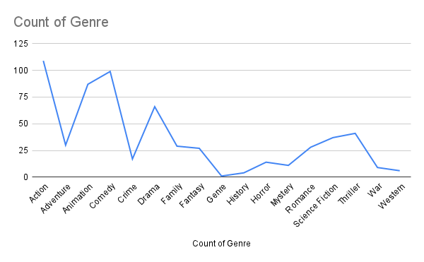

Bar charts instead can accommodate information about categories and frequencies or statistics associated with these categories. Another helpful thing is that we know that categorical attributes can be reordered in any way we like when mapped in a chart like this one. Having the ability to reorder the bars of a bar chart is very useful because it allows us to read the progression of values easily. Note that this is not true if you have a similar chart with ordinal or quantitative data on the X-axis.

**Now try to create a meaningful line plot.**

You can create new columns after transforming some of the features to show a more granular plot, i.e., you could create a column Release Year where you only show the year of the Release Date.

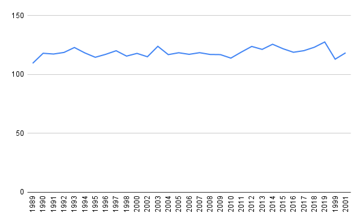

## Fundamental Graphs & Tableau

Now it's time to introduce Tableau. Tableau is a Business Intelligence tool for visualization, very widely used in the industry.

With this project, you will have a taste of the steps we will require you to take in the upcoming projects. Which will all be carried out using Python and several Python libraries.

Being a Data Analyst or Scientist involves a lot of different skills, and coding is just one of them. Critical and analytical thinking are the most important ones, along with creativity and curiosity. Writing code will be the tool for you to achieve more complex and complete results than the ones described in this first assignment.

However, it is important for you to understand the mental process that should guide you from now on.

Follow all the steps, and feel free to explore more than what is asked here.

More detailed explanations will come along the way.

- Download and install the free version of Tableau, [Tableau Public](https://www.tableau.com/products/public/download).
- Open Tableau, and under Connect, select "Text file"
- Import the movies.csv file.
- You will see the data source and how Tableau interprets it.
- You will see that Tableau creates a new Column every time it finds space.
- Under text file Properties, change the separator into a comma.

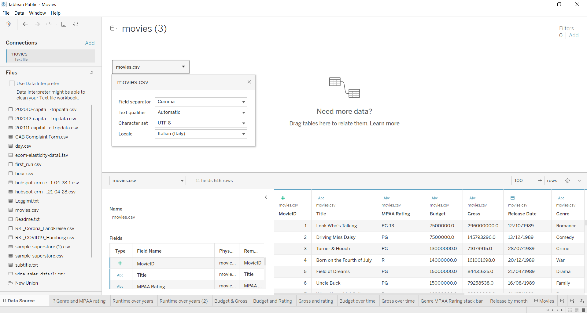

- Now you should be able to see the table well formatted.
- Select the box "Cleaned with Data Interpreter" to clean the values.
- Click on Sheet 1 and start to do the first plot.

### Bar Charts

A bar chart allows you to visualize how a quantity distributes across categories. So every bar represents one category, and the length of the bar represents a quantity.

You can read more on bar charts here: [https://www.storytellingwithdata.com/blog/2020/2/19/what-is-a-bar-chart](https://www.storytellingwithdata.com/blog/2020/2/19/what-is-a-bar-chart)
This excellent blog post explains most of the plots you will use. Wait to start reading everything; otherwise, you will get lost, but save it somewhere. Then, as you explore more plot types during the assignment, you can read about them and understand them better.

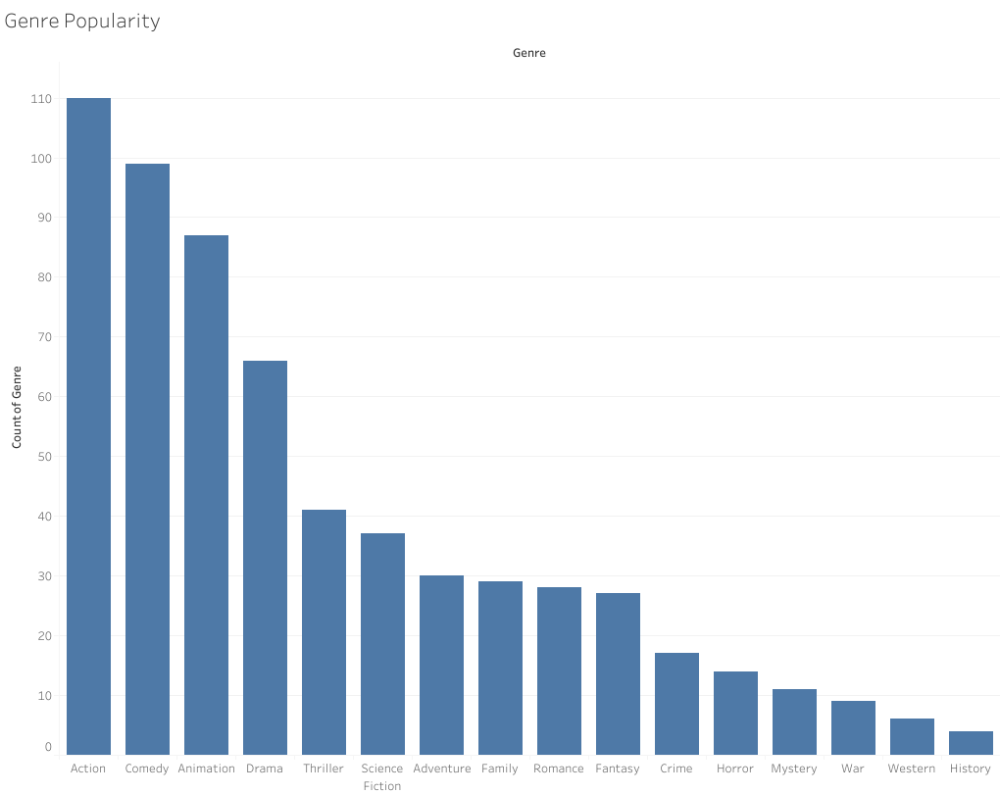

Instructions:

- Drag and drop the Genre on the Columns shelf. Do the same on the Rows shelf, then right-click on it and select Measure - Count.
- Right-click on the Null category and select Exclude to exclude it from the plot (you will see that the Filter tab gets filled)
- Right-click on the Genre Columns and select Sort. Choose Sort by Field.
- Right-click on the labels and select Rotate Label to rotate.

### Pie Chart

Pie Charts are one of the most used data visualization graphs. Read here when you should use it and why: [https://www.storytellingwithdata.com/blog/2020/5/14/what-is-a-pie-chart](https://www.storytellingwithdata.com/blog/2020/5/14/what-is-a-pie-chart)

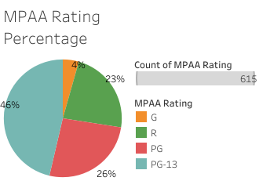

Instructions:

- Drag and drop MPAA Rating on both Columns and Rows shelves, right-click on one of them and choose Measure - Count.
- Go to Show Me (top right corner) and select Pie Chart.
- Drag the MPAA Rating on Label Marks and select Measure - Count. This will make some numbers appear on the Pie Chart.
- Right-click on it and select Quick Table Calculation - Percentage.
- Right-click again, select Format, and under Default, Numbers, select Percentage and 0 Decimal places.

### Line plot

So the line chart allows you to visualize how a quantity changes in relation to another quantity. One of these quantities is usually temporal, but not always. Line plots are useful to investigate time-based patterns: [https://www.storytellingwithdata.com/blog/2020/3/24/what-is-a-line-graph](https://www.storytellingwithdata.com/blog/2020/3/24/what-is-a-line-graph)

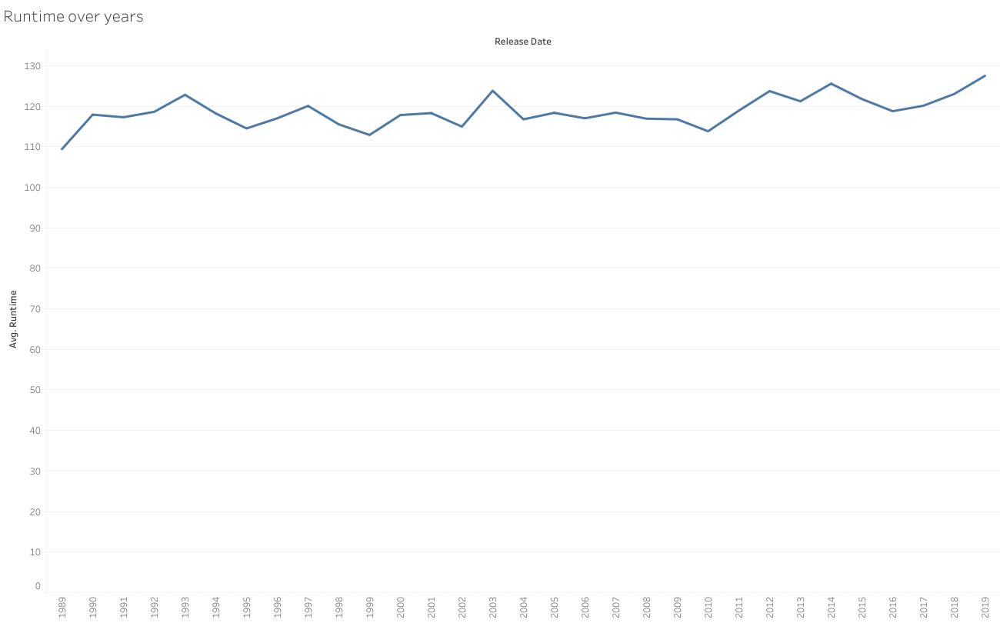

Instructions:

- Move the Release Date to the Columns shelf and Runtime to the Rows shelf.
- Play with LODs ( Level of Details) and calculate average runtime.

Make another line plot similar to the one in the figure below, showing the seasonality of movie releases.

### Scatterplot

With the scatter plot, we can visualize how a quantity relates to another quantity.

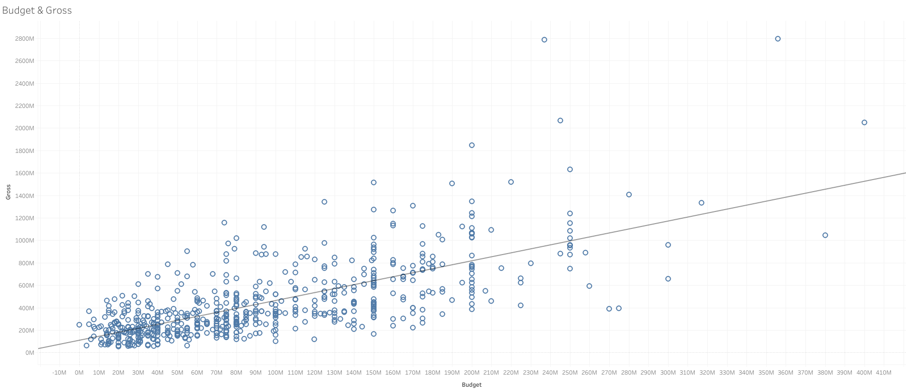

### Three attributes

In all the plots previously seen, we always compare 2 variables. But we can also use techniques to compare 3 variables simultaneously.

A stack bar chart is one example, and it is good if we want to understand the proportion of values within each category.

Another one is the grouped bar chart, in which we have exactly the same information but are represented by a different configuration. In this case, the same bar graph is repeated multiple times for the number of categories that exist for the other categorical attribute. This is better when the goal is to compare every value to one another.

Try to compare the occurrences of movie genres and their MPAA Rating by dragging the MPAA rating on the color section. Check both the stack bar plot and the grouped bar plot.

Get inspiration by checking the following website: [https://public.tableau.com/app/discover/viz-of-the-day](https://public.tableau.com/app/discover/viz-of-the-day)

### Four attributes

Size can be combined with colors in scatter plots to introduce 4 variables. **Try it out.**

Remember that sometimes having too much information on the same plot might lead to a very confusing analysis, so it is not always a good idea to do so. Sometimes it is more beneficial to have 2 different plots instead of showing 4 variables in one plot.

### Keep exploring the dataset

Your task for the next 2 days is to create a lot of plots and understand them. Keep it simple with line plots, histograms, pie charts, bar charts, and scatter plots.

_Remember, most of them will not be very useful, or they will not tell us anything about the data._

In the best scenario, they will deny or confirm some of our assumptions. Then, the day before the presentation deadline, start deciding which plots you want to keep and create a presentation around. The main goal will be identifying trends, relations, and interesting facts. It is all up to you, but remember that everything you write needs to be supported with evidence. And the evidence may lay in the data.

### Prepare the presentation

You can use any software to create the presentation; if you need to know which one, try using Canva ([https://www.canva.com/](https://www.canva.com/)).

Remember that the presentation you will do will be for a non-technical audience, probably for someone that has never seen the dataset before. Therefore you need to be very clear about what you are trying to prove. Also, try to use more or less the same color styles within all your plots to keep them consistent.
