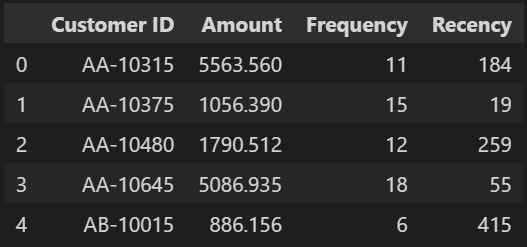
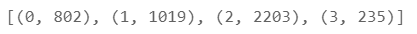
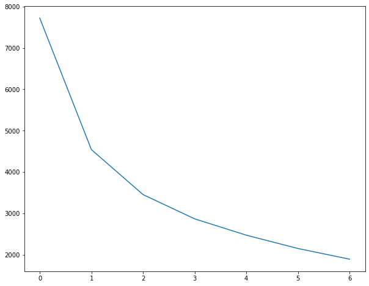
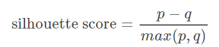

In this sprint, you will use an unsupervised learning method, which draws references from unlabeled datasets. Generally, it is used to find meaningful structure, explanatory underlying processes, generative features, and groupings inherent in a set of examples.

Clustering is the task of dividing the population or data points into several groups such that data points in the same groups are more similar to other data points in the same group and dissimilar to the data points in different groups. On a fundamental level, it is a collection of objects based on similarities and dissimilarities between them.

In this project, you will focus on the most common algorithm for this kind of ML technique, the **K-means algorithm**.

The article ["Understanding K-means Clustering in Machine Learning"](https://towardsdatascience.com/understanding-k-means-clustering-in-machine-learning-6a6e67336aa1) specifies that the K-means algorithm assembles data points based on common characteristics.

According to the [documentation](https://scikit-learn.org/stable/modules/clustering.html#k-means), _" (the) KMeans algorithm clusters data by trying to separate samples in n groups of equal variance, minimizing a criterion known as the inertia or within-cluster sum-of-squares... This algorithm requires the number of clusters to be specified, "_ which is what the _k_ stands for in the name of the algorithm. Inertia, on the other hand, _"... can be recognized as a measure of how internally coherent clusters are."_ For more information about these concepts, visit the official documentation in the link we have provided. **We will only look at the _K-means clustering method_ because it is the most widely used.**

## Clustering

When working with sales data, a common thing to do is to understand the customers' buying patterns using 3 parameters:
Monetary (amount of money spent),
Frequency (how frequently the customer bought something)
Recency (how many days has passed from today to their last purchase).

These parameters are not given to us; we will have to calculate them.

First, we will create a new DataFrame by grouping the customers based on their ID and summing the Sales column:

```python
df_monetary = df.groupby('Customer ID', as_index=False)['Sales'].sum()
df_monetary.head()
```

Do the same with Frequency (How many unique Order IDs are there per customer?) and the Recency (Calculate it from the last order date in the dataset) and then merge all the 3 DataFrames.

You will end up with a DataFrame similar to the one below:



### Dealing with outliers

Try to visualize with a boxplot these 3 parameters: are there outliers? Because of its nature, the K-Means algorithm is susceptible to outliers. To check the consequences of having outliers when using a K-Means algorithm, read this article: [Effect of outliers on K-Means algorithm using Python](https://medium.com/analytics-vidhya/effect-of-outliers-on-k-means-algorithm-using-python-7ba85821ea23)

Remove each feature's (statistical) outliers using the Interquartile Range (IQR is the difference between the upper quartile and the lower quartile).

### Feature scaling

Because of the nature of the algorithm, it is crucial to rescale the variables so that they have a comparable scale. There are two common ways of rescaling:
Min-Max scaling (rescale all values within the range of 0 to 1) and
Standardisation (mean-0, sigma-1)

Here, we will use Standardisation Scaling.

```python
# Rescaling the attributes
rfm_df = rfm[['Amount', 'Frequency', 'Recency']]

# Instantiate
scaler = StandardScaler()

# fit_transform
rfm_df_scaled = scaler.fit_transform(rfm_df)
rfm_df_scaled.shape

rfm_df_scaled = pd.DataFrame(rfm_df_scaled)
rfm_df_scaled.columns = ['Amount', 'Frequency', 'Recency']
rfm_df_scaled.head()
```

### Building the model

K-means clustering is one of the simplest and most popular unsupervised machine learning algorithms. The algorithm works as follows:

- First, we randomly initialize _k_ points, called means. In this case, we will use 4 as a value.

- We categorize each item to its closest mean and update the mean's coordinates, which are the averages of the items categorized in that mean so far.

- We repeat the process for a given number of iterations, and, in the end, we have our clusters.

```python
# k-means with some arbitrary k
kmeans = KMeans(n_clusters=4, max_iter=50)
kmeans.fit(rfm_df_scaled)
```

```python
# Assign the labels to each data point, and execute the following script.
kmeans.labels_
label_list=kmeans.labels_
sorted(Counter(label_list).items())
```



### Finding the optimal number of clusters

As said before, we randomly decided that the number of clusters is 4. However, is it the optimal number?

There are two methods to determine the best k: **the Elbow method and the Silhouette analysis.**

**_The Elbow Method_**

According to the article [Elbow Method for optimal value of k in KMeans](https://www.geeksforgeeks.org/elbow-method-for-optimal-value-of-k-in-kmeans/), _" a fundamental step for any unsupervised algorithm is to determine the optimal number of clusters into which the data may be clustered. The Elbow Method is one of the most popular methods to determine this optimal value of k."_

Although our first thought might be that increasing the number of parameters (_k_) will improve the fit of our model, we risk over fitting it. The Elbow Curve will help us identify when, if we were to add more clusters, it would only add so much more information to our model. The optimal _k_ value will be where the average distance falls off suddenly. Which is when the curve starts to become parallel to the x-axis.

```python
# Elbow-curve /SSD
ssd = []
range_n_clusters = [2, 3, 4, 5, 6, 7, 8]
for num_clusters in range_n_clusters:
    kmeans = KMeans(n_clusters=num_clusters, max_iter=50)
    kmeans.fit(rfm_df_scaled)

    ssd.append(kmeans.inertia_)

# plot the SSDs for each n_clusters
plt.plot(ssd)
```



In this case, we can assume that the optimal number of clusters is 3, but it needs to be clarified as the Elbow is not very prominent.

**_Silhouette Analysis_**

Another way to determine the number of clusters is by using Silhouette Analysis. According to the [scikit-learn documentation](https://scikit-learn.org/stable/auto_examples/cluster/plot_kmeans_silhouette_analysis.html), _" can be used to study the separation distance between the resulting clusters. The silhouette plot displays a measure of how close each point in one cluster is to points in the neighboring clusters and thus provides a way to assess parameters like number of clusters visually."_ Some people argue [that the Silhouette Analysis is better](https://towardsdatascience.com/silhouette-method-better-than-elbow-method-to-find-optimal-clusters-378d62ff6891) than the Elbow Method.



- _p_ is the mean distance to the points in the nearest cluster that the data point is not a part of.

- _q_ is the mean intra-cluster distance to all the points in its own cluster.

- The value of the silhouette score range lies between -1 to 1.

- A score closer to 1 indicates that the data point is very similar to other data points in the cluster.

- A score of 0 indicates that the sample is on or very close to the decision boundary between two neighboring clusters.

- A score closer to -1 indicates that the data point is not similar to the data points in its cluster.

```python
# Silhouette analysis
range_n_clusters = [2, 3, 4, 5, 6, 7, 8]

for num_clusters in range_n_clusters:

    # intialise kmeans
    kmeans = KMeans(n_clusters=num_clusters, max_iter=50)
    kmeans.fit(rfm_df_scaled)

    cluster_labels = kmeans.labels_

    # silhouette score
    silhouette_avg = silhouette_score(rfm_df_scaled, cluster_labels)
    print("For n_clusters={0}, the silhouette score is {1}".format(num_clusters, silhouette_avg))
```

Based on the information given here and some research online, determine whether _k=3_ is the right choice.

## Train your model

Now train your final model with the appropriate value of _k_.

Then, assign the resulting labels to the Monetary, Frequency, and Recency DataFrame (before scaling).

```python
# assign the label
rfm['Cluster_Id'] = kmeans.labels_
rfm.head()
```

And then try to visualize the results:

```python
# Box plot to visualize Cluster Id vs Amount
sns.boxplot(x='Cluster_Id', y='Amount', data=rfm)

# Box plot to visualize Cluster Id vs Frequency
sns.boxplot(x='Cluster_Id', y='Frequency', data=rfm)

# Box plot to visualize Cluster Id vs Recency
sns.boxplot(x='Cluster_Id', y='Recency', data=rfm)
```

Now that you've gone through these basic steps, you can draw conclusions about the behavior of the three groups.

## Consider more parameters (optional)

The above analysis is elementary: it only considers 3 elements of a dataset that contains a lot of information.

Try to think about other parameters that you could consider in the analysis that makes sense. For example:
Are there any perceivable differences in behavior between Corporate and Consumer Segments?
Could you deduce patterns between the product categories?
Are there any noteworthy differences between the states?

**Estimated time: 1 week**

### Feedback Form

<embeddediframe title="Project-1-feedback-form" height="1000px" link="https://docs.google.com/forms/d/e/1FAIpQLSfxACEn_EvqbI2LeEj9Tl-t_dmWRbvfeWaESViI-r42QzHN_A/viewform?embedded=true"/>
