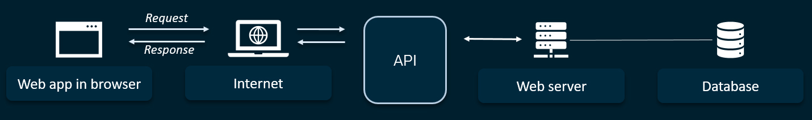

Welcome to **Project 6**.

In this 2 week project (with an optional 3rd week), you will build what the community refers to as a **Data Pipeline**. A data pipeline is a series of data processing steps. Data pipelines consist of three key elements: a source, a processing step or steps, and a destination. Any time data is processed between point A and point B (or points B, C, and D), there is a data pipeline between those points.

Usually the data source is either something we can scrape from the web, or something we can get from an API.

**Web scraping** is the process of extracting data from websites and storing them in order to analyze them or use them in some way. During web scraping, texts are read from websites in order to obtain and store information. This is comparable to an automatic copy-and-paste process. For image searches, this technique is referred to as image scraping. Scraping is not always legal and scrapers must first consider the copyrights of a website.

There are several difficulties when it comes to web scraping; luckily, there are various libraries to help you overcome these problems. The easiest libraries to use for Python are called [Beautiful Soup](https://beautiful-soup-4.readthedocs.io/en/latest/) and [Scrapy](https://scrapy.org/). However, they will not work with dynamic web pages, only static pages. _Dynamic_ means the data is generated from a request after the initial page request. _Static_ means all the data is there at the original call to the site. Another library widely used to overcome the problem of scraping dynamic pages (most modern websites behave in a dynamic way) is called [Selenium](https://www.selenium.dev/documentation/webdriver/).

**API** means "Application Programming Interface" and it is code which enables data transmission from one software to another.

The software that needs to access information (i.e., X hotel room rates for certain dates) or functionality (i.e., a route from point A to point B on a map based on a user’s location) from another software, calls its API while specifying the requirements of what data/functionality must be provided. The other software returns data/functionality requested by the first application.  
The interface by which these two applications communicate is what the API specifies. There are different kinds of API, but the most common class of API is the Web API. These APIs mainly deliver requests from web applications and responses from servers using Hypertext Transfer Protocol (HTTP).

Here is the project overview:
WEEK 1:

1. Scrape article titles from a news website using BeautifulSoup and save it locally.
2. Use a free and public Web API to get some related data, which we will then save locally.
3. Create some graphs using the likes of [Plotly Express](https://plotly.com/python/plotly-express/).
4. Get introduced to NLP (Natural Language Processing) and [HuggingFace](https://huggingface.co/), a machine learning and data science platform and community that helps users build, deploy and train machine learning models.
5. Deploy a SQL Server on [Railway](https://railway.app/) with either PostgreSQL or SQLite. The database design will mirror the data which the server will later receive from the API and Scraper code, once they are deployed as part of the pipeline.

WEEK 2:

1. After that, we will read them and display them in a plot using a popular web-based Python framework called [Streamlit Cloud](https://streamlit.io/cloud).
2. We will deploy the Python code to get data from the API using Amazon Web Services (AWS) Lambda, which will allow us to automatically run the code every day.

WEEK 3 (OPTIONAL):

1. We will delve further into the topic of NLP and also start on Time Series modelling.
2. Once we have understood the basics, we will apply time series modelling to the data from the API, and sentiment analysis to the scraped news headlines to round out our Streamlit application.

It sounds complicated, but step by step you will see its power and advantages.
